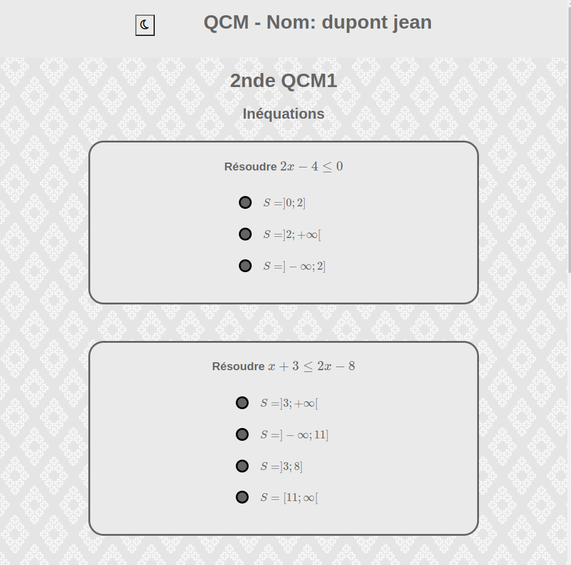

# [qcmqkzk.herokuapp.com](https://qcmqkzk.herokuapp.com)

Publish a multiple choice questions to your student from a simple markdown file.

Since this project is aimed to French teachers, the rest of the description is in French.

# Présentation

Ce projet permet de créer des QCMs depuis un fichier source markdown et de les diffuser facilement aux élèves.

## TL:DR;

1. Vous créez un fichier QCM
2. Vous créez un compte, le validez via l'email envoyé et vous connectez
3. Vous envoyez votre QCM
4. Vous vérifiez qu'il est présenté comme vous l'imaginiez
5. Vous présentez le numéro du QCM aux élèves
6. Ils rejoignent, saisissent leur nom, prénom et le numéro en question...
7. Ils répondent aux questions et valident
8. Vous récoltez leurs scores et leurs réponses



## Format de fichier

Le plus simple est de regarder cette [vidéo](https://youtu.be/Jogm2cbgnEE) ou de partir de [l'exemple](./src/static/markdown/exemple.md).

En gros :

```markdown

# titre du QCM

## une partie

### question à choix multiple ?

sous texte de la question

- [x] bonne réponse
- [ ] mauvaise réponse a
- [ ] mauvaise réponse b

### question avec une zone de texte ?

- [t]
```

## Deux types de questions :

* avec **une seule bonne réponse**. L'élève ne peut en choisir plusieurs. Corrigées automatiquement.
* avec **une zone de texte**. L'élève écrit un texte pour répondre. Vous devez lire les réponses.

## Intégration de code

Vous pouvez intégrer du code en ligne en l'entourant d'accents graves `` `f(x)=3` `` 

Pour du code dans le sous-texte :

~~~markdown

```python
a = 1
def f(x):
    return x ** 2
```
~~~

Attention, seuls les ```` ``` ```` sont supportés, pas les `~~~`.

Si vous indiquez le langage du code en question, il sera colorié automatiquement.

## LaTex

LaTex en ligne avec `$\int_1^2 x^2 dx$` va produire $\int_1^2 x^2 dx$

LaTex en bloc avec `$$`

```latex
$$
\int_1^2 x^2 dx
$$
```

va produire

$$
\int_1^2 x^2 dx
$$

## Images

Vous pouvez présenter une image _à condition qu'elle soit hébergée en ligne_.

Impossible de charger des images directement dans le fichier, je n'ai pas la place
pour les héberger ni aucune envie de l'ajouter.

```markdown

```

va produire :


## Tableaux

Les tableaux markdown sont supportés nativement :

```markdown
| nom   | prénom | note |
|-------|--------|------|
| Jean  | Dupont | 14   |
| Marie | Frank  | 20   |
```

va produire :

| nom   | prénom | note |
|-------|--------|------|
| Jean  | Dupont | 14   |
| Marie | Frank  | 20   |

# Mode anti-triche

* Les parties, questions et choix sont mélangés. C'est automatique et différent pour chaque élève.
* On ne peut pas cliquer sur les images (pour faire une recherche en ligne).
* Si l'élève quitte la page, ses réponses sont enregistrées et il ne peut plus avancer.
* Il peut toujours retenter... mais vous verrez à quelle heure il a répondu

# Correction

Les points des questions à choix multiple sont calculés automatiquement

Un mode correction est proposé, permettant de consulter chaque devoir pour les réponses textuelles.

On peut exporter l'ensemble des travaux dans un fichier csv (notes et réponses).

# Hébergement des données

Elles sont en Europe et je _crois_ respecter le RGPD.

Les élèves n'ont pas de compte, ils indiquent leurs noms, prénom et numéro du devoir.
Les réponses des élèves sont effacées après trois jours. Ne tardez pas :smile:

Les enseignants doivent créer un compte, je n'en garde que l'email.
Chaque QCM et travail d'élève est attribué à un enseignant, via le numéro du QCM.

Les QCM sont eux aussi effacés après trois jours, n'ayant pas la place pour en conserver beaucoup.

# Technologies utilisées

* Python 3
* Flask (création des pages)
* Extensions Flask : Flask-WTF, FlaskAlchemy, FlaskLogin etc.
* Gunicorn (serveur web WSGI)
* PostgreSQL (bdd)
* Mathjax (latex)
* Heroku (service en ligne dans le cloud)
* AWS (hébergement interne de heroku)

# Problèmes, bugs ?

N'hésitez pas à déposer une issue ! Je ferai de mon mieux :smile:

# Comment ça marche en interne ?

Le code est là pour vous répondre...

---

# Development

## Roadmap

### Features

- [x] mode anti triche
- [ ] chronomètre
- [ ] multiple valid answers
- [x] text answers
- [ ] move something ??? geogebra like object

### Models

- [x] QCM original
- [x] Student
- [x] Marks

### Parsing

- [x] fichier .md -> model bdd

### Export -> html

- [x] mélanger
- [x] regrouper les résultats
- [x] cookies
- [ ] présenter une question par page
- [ ] lien entre les pages

### Marks

- [x] enregistrer les réponses de l'élève
- [x] compter les points

### Export Marks

- [x] exporter les notes d'un QCM
- [x] télécharger un csv
- [x] nettoyer la bdd après l'envoi et régulièrement (RGPD)

### Views

- [x] upload a .md (basic)
- [x] validate upload
- [x] qcm
- [x] validate

### Style

- [x] base
- [x] custom for teacher
- [x] custom for student
- [x] latex

## Mixing answers

- [x] shuffle les parts, questions, answers
- [x] lorsqu'on envoie les answers à la vue, faut envoyer l'`id_question: id_answer` à la vue
- [x] ensuite on compare `id_question: id_answer` avec `id_question: id(answer where is_correct)`


### Caching

- [ ] utiliser [flask caching](https://flask-caching.readthedocs.io/en/latest/)
- [ ] stratégie : quand on veut accéder à un QCM, le cacher après l'avoir retrieve, le drop si plus de x qcm ?

### Serving

- [x] gunicorn
- [x] postgres
- [x] heroku (i don't understand why I can't use GCP...)

### Migrations

With Flask-Migrate.

1. Ensure `flask app` is in environment
2. `flask db init`
3. Everytime you modify a `db.Model` class, run :

    ```bash
    flask db migrate -m "comment"
    flask db upgrade
    ```

I think that's all.


### Forms with WTF Forms

[Flask-WTF](https://flask-wtf.readthedocs.io/en/1.0.x/)

Almost everything is done.

Last problem is QCM view for student. Check steps below

### Tests with Pytest

[Doc](https://flask.palletsprojects.com/en/2.1.x/testing/)

## Steps

- [x] présenter un qcm
- [x] enregistrer les réponses
- [x] noter les réponses
- [x] afficher des récaps : 
    - [x] ensemble des qcm
    - [x] notes d'un qcm
    - [x] notes d'un étudiant
- [x] style pour chaque page
- [x] latex
- [x] block content etc.
- [x] exporter en csv
- [x] nettoyer
    - [x] la bdd
    - [x] les fichiers downloadés
- [x] mélanger
    - [x] parts
    - [x] questions
    - [x] ajouter "je ne sais pas"
- [x] serve with gunicorn
- [x] séparer le modèle de la création des instances
- [x] déployer qq part : **HEROKU : [qcmqkzk](https://qcmqkzk.herokuapp.com/)**
    - [x] vues 
    - [x] upload
    - [x] download
    - [x] bdd

        * impossible de run heroku et sqlite, il faut switch : [hero sqlite](https://devcenter.heroku.com/articles/sqlite3)
        * [postgres](https://towardsdatascience.com/deploy-a-micro-flask-application-into-heroku-with-postgresql-database-d95fd0c19408)
        * Many fixes needed...
            1. setup postgres locally following [archwiki](https://wiki.archlinux.org/title/PostgreSQL)
            2. add postgres to heroku with [medium](https://towardsdatascience.com/deploy-a-micro-flask-application-into-heroku-with-postgresql-database-d95fd0c19408)
                some steps are wrong :

                1. Flask-Migrate doesn't work like this anymore.
                2. the uri-database can't start with `postgres` but with `postgresql` so we have to ensure the setup is rectified IN THE CODE. Since changing it in `setup.sh` does nothing.
                3. Once everything is working you can log into the DB with `heroku pg:psql postgresql-clear-05212 --app casting-agency-xw` where postgresql-clear-05212 is the name of the DB (found [here](https://dashboard.heroku.com/apps/qcmqkzk/resources))
                4. You can log into the dyno with `heroku run bash`, see the logs with `heroku log --tail`
    - [x] Fix "bad CSRF token" or "CSRF token is missing", raising 400 errors
        When using a random secret_key in flask with gunicorn, AFAIK the page may be generated
        by a worker and the next request received by another. When they start, the key is changed.
        The solution is to setup a key in `env`, with : 

        ```heroku
        FLASK_SECRET_KEY: "a random secret key from secrets.urlsafe(16)"
        ```

        Then read the key in application.
        See [commit](https://github.com/qkzk/qcm_alchemy/commit/cd0bbc4a49a9b3186e335dc6af6691db7c5c9331)
        issue: [#35](https://github.com/qkzk/qcm_alchemy/issues/35)

- [x] styling : banner, radio, infos dans base, uniformité
- [x] test hosting
    - [x] hammering and intense testing. Sort of. Résultat : 13ms pour le contenu. QQ ms pour le rendu. trop jde JS.
- [x] limit strings, safe inputs and good practices
- [x] RGPD et tutoriel
- [x] login pour enseignant ???
    - [x] proposer un numero pour consulter les QCM notes
    - [x] demander le numéro lorsqu'on cherche à consulter les résultats
    - [x] trouver un moyen de consulter les notes pas élève... compliqué
    - [x] migrer la database de heroku
- [x] refactor app
- [x] refactor model
- [x] Text answers
- [x] light/dark mode
- [ ] refactor views
- [x] remove `setup.sh` from git history. Password changed
- [x] login
    - [x] flask login
    - [x] forcer les enseignants à se logguer
    - [x] empecher les enseignants de consulter des autres QCM que les leurs
    - [x] requirements.txt
    - [x] problème des librairies qui foirent voir l'import initial dans sendmail
            comment résoudre ça dans heroku ?
    - [x] comment stocker des token dans heroku ?
    - [x] refactor tous les nouveaux trucs, les textes etc.
    - [x] migrer la bdd de heroku
    - [x] supprimer un compte
    - [x] confirm real addresses
    - [x] change password
- [x] parser : now detects code blocs properly, allowing lines starting with `#` in code blocks.
- [ ] Flask-WTF
    - [x] simple views (login, reset password, change password, student)
    - [x] new qcms
    - [x] csrf everywhere
    - [ ] qcm views for student. [SO question](https://stackoverflow.com/questions/11622592/wtforms-create-variable-number-of-fields) [doc](https://wtforms.readthedocs.io/en/3.0.x/specific_problems/#dynamic-form-composition)
        must be dynamicly composed
        check for radio element insertion
        find a way to retrieve correct ids for question -> ansers and text-question -> text-answer
- [x] Flash instead of message passing to views
- [ ] hosting
    - [ ] créer une adresse expres ?
    - [ ] utiliser une adresse du nom de domaine ???
- [ ] creates review for students... ????
